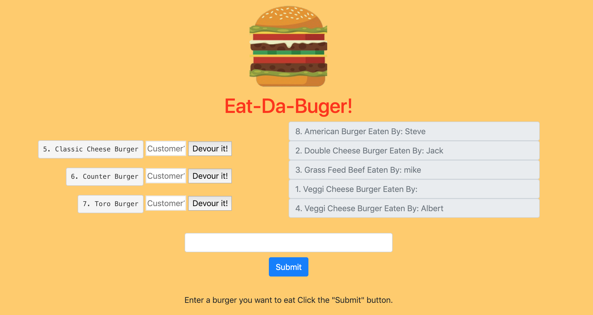

# Burger App with Node, Express and Handlebars and Sequelize ORM

[Deployed Site](https://cryptic-citadel-68537.herokuapp.com/)

### Overview

* Eat-Da-Burger! is a restaurant app that lets users input the names of burgers they'd like to eat.

* Whenever a user submits a burger's name, your app will display the burger on the left side of the page -- waiting to be devoured.

* Each burger in the waiting area also has a `Devour it!` button. When the user clicks it, the burger will move to the right side of the page. If you fill out the customer field, the customers name will be displayed next to the burger thet devoured.

* The app will store every burger in a database, whether devoured or not.

* Once the burger is devoured the customer is stored in the database with an association to the burger they devoured.

## Installation

To install the application follow the instructions below:

	git clone https://github.com/Bgosse1/sequelizedBurger.git
	cd sequelizedBurger
	npm install

To setup the database follow the instructions below:
* Connect to your mysql server and run the schema.sql file.
* Run the seeds.sql to populate the table.

## Running Locally
Before running locally change the connection information in the development section of the config.json file to point to your local database.

To run the application locally and access it in your browser, run

	node server.js

The application will now be running locally on port 8080. You can then access it locally from your browser at the URL `localhost:8080`.
